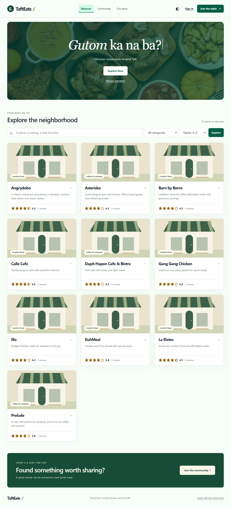

# TaftEats

A neighborhood food journal for the community around DLSU Taft. Discover restaurants, share rich-text reviews, vote on useful experiences, and talk with restaurant owners.

Built with Express, EJS, and MongoDB, with accessible interfaces, consistent data, and automated verification.



## Run locally

Use Node.js **22.13+ or 24+**, npm, and MongoDB **7.0+ running as a replica set**. MongoDB Atlas supports the transactions used for reviews, votes, conversations, account deletion, and migration. A standalone MongoDB instance does not.

```sh
npm ci
cp .env.example .env
# Fill in MONGO_URI and a random SESSION_SECRET.
npm start
```

On PowerShell, use `Copy-Item .env.example .env`. Generate a secret with `node -e "console.log(require('node:crypto').randomBytes(32).toString('hex'))"`. Never reuse a published or demo secret.

The normal app listens at [localhost:3000](http://localhost:3000). Cloudinary is optional; without all three Cloudinary variables, reviews and registration work without attachments. Do not connect a development copy to a production database.

## Try the isolated demo

```sh
npm run preview:demo
```

Open [127.0.0.1:3001](http://127.0.0.1:3001). This creates an ephemeral MongoDB replica set with **22 fictional accounts, 10 sample restaurants, and 30 sample reviews**. It never reads `.env` or connects to the configured application database. The first run downloads a MongoDB binary. Stop the process to discard its database.

| Demo role     | Username        | Password                    |
| ------------- | --------------- | --------------------------- |
| Reviewer      | `jane_d`        | `TaftEats demo passphrase!` |
| Prelude owner | `owner_prelude` | `TaftEats demo passphrase!` |

These credentials are only for isolated demo data. The demo uses illustrative restaurant images, not photographs or verified business listings.

For a persistent demo, set `DEMO_MONGO_URI` to an **empty** database named `tafteats_demo` or `tafteats_demo_<suffix>` and run `npm run seed:demo`. The script refuses production mode and existing data; it never falls back to `MONGO_URI` or deletes collections.

## Quality checks

```sh
npm run check             # ESLint, formatting, unit and HTTP integration tests
npm run test:coverage     # Node's coverage report
npm audit                # Full dependency tree, including development tooling
npm run secrets:check    # High-confidence working-tree credential checks
npm run test:browser     # Browser journeys, responsive checks, and axe accessibility checks
```

Browser tests use installed Chrome by default. Alternatively, run `npx playwright install chromium` and set `PLAYWRIGHT_CHANNEL=chromium`. Browser tests start their own isolated preview when port 3001 is free. CI checks Node 22 and 24, runs the browser suite, and retains failure traces.

## Security and engineering

- Passwords use asynchronous scrypt (`N=131072`, `r=8`, `p=1`) with a random salt. At most two password calculations run per process; excess requests receive 503 without queuing credentials. Valid legacy HMAC logins upgrade automatically.
- Sessions rotate at login, use HTTP-only SameSite cookies and HTTPS-only production cookies, and live in MongoDB. Every mutation requires a session-bound CSRF token.
- Database-backed authorization uses immutable IDs and reloads account roles on every request. Owners cannot review their own restaurant, and authors cannot vote on their own reviews.
- Rich text uses a parser-based allowlist on writes and reads, including legacy records. Browser activity cards use DOM text nodes. CSP blocks inline handlers, external scripts, framing, and arbitrary media origins.
- Shared MongoDB rate limits protect authentication, uploads, and application requests. Uploads check file signatures, restrict formats, bound fields/files, cap concurrent requests, and clean up newly uploaded assets when a database save fails.
- Votes update atomically. Optimistic concurrency prevents edits and replies from silently overwriting each other. Ratings come from review data, including the zero-review case. Account deletion uses a transaction and requires the current password.
- Discovery has server-side literal search, category filters, sorting, and pagination. Reviews and profile activity are bounded. Mobile layouts, reduced-motion support, keyboard controls, and light/dark themes are verified in the browser.

See [architecture](docs/ARCHITECTURE.md), [security](SECURITY.md), the [migration guide](docs/MIGRATION.md), [database recovery](docs/RECOVERY.md), and [media recovery](docs/MEDIA.md) for operational boundaries and deployment requirements.

## Project structure

```text
app.js                    Local/serverless entry point
src/app.js                Express app factory; middleware and rendering
src/server.js             Lazy connection, persistent sessions, runtime lifecycle
src/config/               Validated environment and Cloudinary configuration
src/controllers/          HTTP use cases
src/middleware/           Authentication, CSRF, rate limits, bounded uploads
src/lib/                  Input validation, HTML sanitization, errors, passwords
src/services/             Review presentation, derived ratings, media lifecycle
src/models/               Mongoose schemas, indexes, optimistic concurrency
src/routes/               Route wiring and authorization before controllers
src/views/                EJS pages and shared partials
src/public/               Styles, browser behavior, local SVG artwork
database/                 Isolated demo fixtures and explicit migration
tests/                    Unit, real MongoDB HTTP, and browser regression tests
```

## Development

The current application is developed and maintained by **Bullet** ([portfolio](https://buklet.vercel.app)).

The original CCAPDEV course project was created by **Clyde** (frontend), **Jasper** (backend), **Bullet** (full stack), and **Ella** (project management).

This application is maintained in the private [TaftEats repository](https://github.com/bukleeet/TaftEats), with `main` as its production branch and [tafteats.vercel.app](https://tafteats.vercel.app) as its production address. The original academic project is preserved separately in [CCAPDEV_Resto-Review-App](https://github.com/bukleeet/CCAPDEV_Resto-Review-App). The October 4, 2026 release includes verified credential rotation, a backed-up staging and production migration, and a real Cloudinary upload/delete check. See the [release checklist](docs/RELEASE.md) for verification and remaining operational work.
