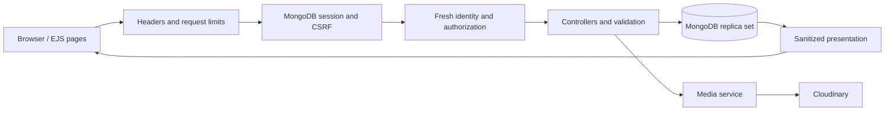

# Architecture

TaftEats uses a small server-rendered Express application rather than separate frontend and backend deployments. EJS pages work for discovery and authentication; browser JavaScript handles richer mutations. One same-origin session and CSRF boundary covers both.

`src/app.js` constructs the app with injected session and rate-limit stores. It performs no database connection at import time. `src/server.js` initializes the connection and persistent session store lazily and shares initialization across concurrent requests. The CLI listens only after MongoDB connects and shuts down on termination; the serverless handler returns a generic 503 when initialization fails.

The entry point also fails closed on invalid environment configuration. Serverless requests receive an uncached generic 503; local startup exits with a failure code. The diagnostic event contains no environment values.

Stylesheet, browser script, and hero image URLs include a SHA-256 content version computed once at startup. A changed deployment therefore uses new asset URLs even when an existing browser tab has cached the previous files. HTML remains uncached, while static assets retain their normal cache lifetime.

## Data ownership

- Users own their profiles and reviews by ObjectId. Usernames are display labels, never an authorization fallback.
- Restaurant ownership is assigned administratively with `role=owner` and `ownedEstablishment`. Public registration always creates a student account. There is no self-service privilege-granting endpoint.
- Reviews contain title, sanitized HTML, rating, media, votes, and a bounded owner/reviewer thread. New messages store an immutable `authorId` alongside their display-name snapshot.
- Legacy ratings remain in the schema for compatibility, but display values come from review aggregates. An empty set has rating zero and displays “New.”

Discovery filtering, sorting, and pagination run in MongoDB. Name sorting limits the page before looking up review totals; rating sorting computes totals for matching restaurants before selecting the page. Both return at most 12 restaurant documents to the application, with deterministic ID tie-breaking. Restaurant-detail rating queries match that restaurant's indexed ID before grouping.

## Write semantics

Votes use one MongoDB update pipeline to toggle one vote and remove the opposite vote. The update increments the review version, so a stale edit cannot overwrite votes. Review edits and thread changes use Mongoose optimistic concurrency; clients receive 409 and refresh when a concurrent write wins.

Account deletion rechecks the current password, removes authored reviews, removes votes, anonymizes reply content on other reviews, and deletes the user in a transaction. Other sessions become unusable because each request reloads the account. External media is deleted after commit; its failures are logged without rolling back the account state.

Creating reviews, voting, and replying also use a transaction that first writes the current user's version. This shared account write serializes new references with deletion; an existence read alone would permit a stale snapshot to add references after deletion. Transaction retries reload identity and ownership, and contain only database operations. Uploads happen beforehand and are compensated if the account disappears. Vote cleanup during deletion touches only reviews containing that user's votes.

Media upload succeeds before a document references its URL. A failed save deletes newly uploaded assets; removed media is deleted after a successful save. Deletion verifies the configured cloud, folder, resource type, and review membership. This is compensation, not a distributed transaction.

## Test boundaries

Unit tests cover validation, sanitization, password compatibility, scoped media URLs, and configuration. HTTP tests use a real temporary MongoDB replica set and cover authorization, CSRF, concurrent writes, transactions, migration, and shared rate limits. Browser tests exercise form submissions, navigation, profile activity, voting, and owner conversations with the actual CSP enabled, and run axe checks on rendered pages.

The demo fixture uses sample restaurant stories, isolated demo passphrases, and reserved `.test` addresses. Local artwork provides predictable offline previews. The hero uses an optimized local copy of the project's original food photograph; its seven-language animation supports pausing and reduced motion. Team attribution remains in the application and README.
